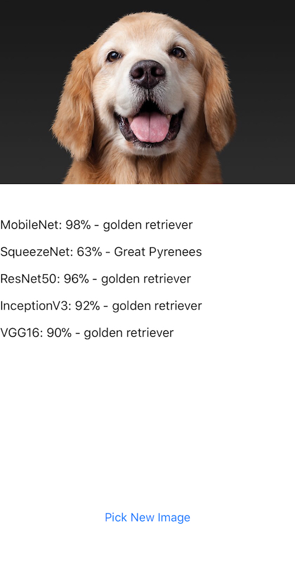

# CoreML-Model-Comparer

CoreML-Model-Comparer is an iOS app that allows you to take/pick an image and automatically pass it through every currently available CoreML model provided by Apple. All CoreML models can be found at [Apple's Machine Learning documentation page](https://developer.apple.com/machine-learning/).

## Requirements

- Xcode 9.2+
- iOS 11.0+

## Getting Started

Download or clone the project and open it in Xcode. Due to the combined size of the CoreML models, I've left the installation of those up to you. Download each of the CoreML models I've listed below, then drag+drop them into the `Models` folder in the Xcode project.

Note: If the direct download links do not work they may have been updated. If that is the case head over to [Apple's Machine Learning documentation](https://developer.apple.com/machine-learning/) to download them.

- [MobileNet](https://docs-assets.developer.apple.com/coreml/models/MobileNet.mlmodel)
- [SqueezeNet](https://docs-assets.developer.apple.com/coreml/models/SqueezeNet.mlmodel)
- [ResNet50](https://docs-assets.developer.apple.com/coreml/models/Resnet50.mlmodel)
- [Inception v3](https://docs-assets.developer.apple.com/coreml/models/Inceptionv3.mlmodel)
- [VGG16](https://docs-assets.developer.apple.com/coreml/models/VGG16.mlmodel)

After bringing the models into the project, run to a device/simulator and select/take an image to see the object classification and confidence after the image has been run through each model.

## Screenshot

